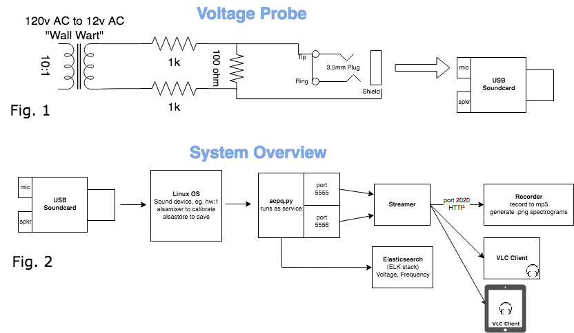
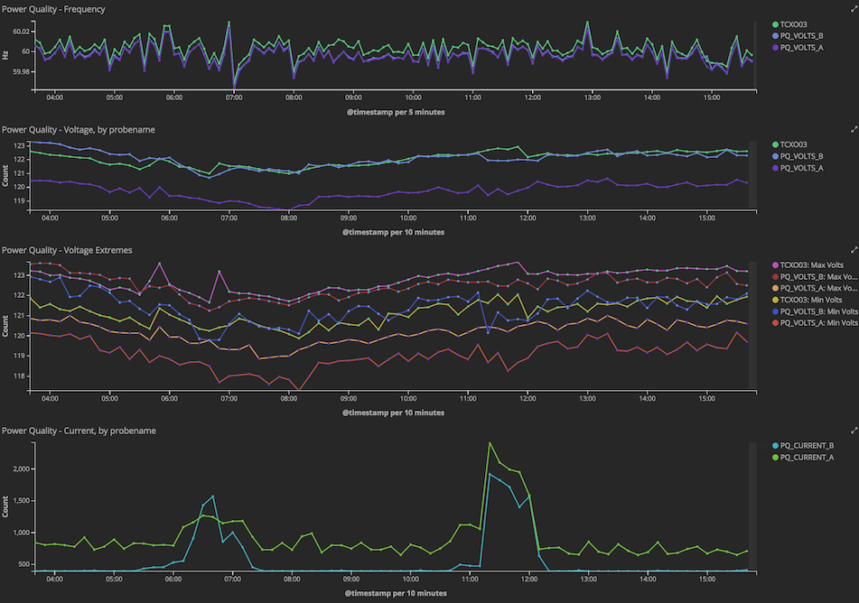
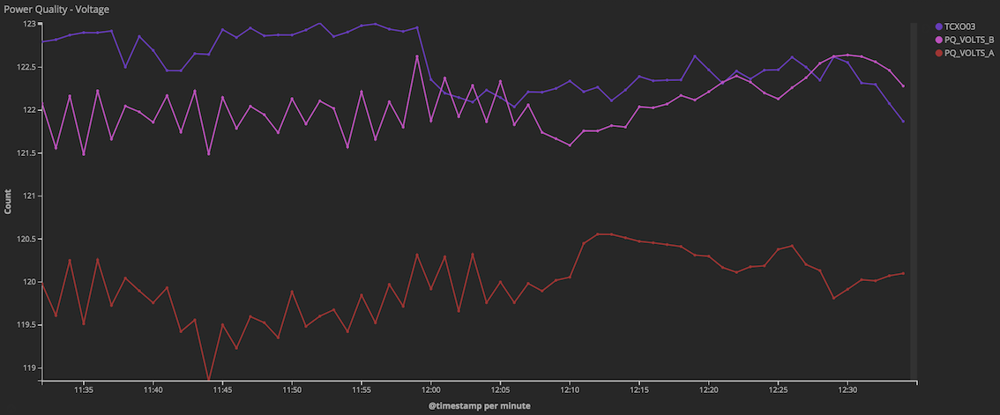
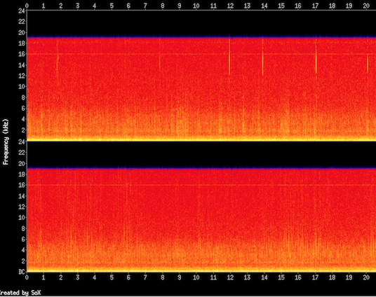

# Power Quality on a Pi


## Synopsis

 

In order to better understand the power grid and related systems, I built a small, low cost device that allows for the measurement of voltage, frequency, and current fluctuations with very high precision. The sensitivity of the device is so great that it can also be used to "listen" to events on the power grid.
With this device I can run a range of experiments and collect data to gain familiarity.

The term power quality is an industry term that refers to the quality of electricity, namely how well all aspects of the electricity are within acceptable ranges.

In this article I will introduce the experiment, show how it is built, and then I’ll share my observations and what I have learned so far.

Thanks to the folks in /r/signalidentification for showing interest and encouraging me to write this article.

##  System Overview




## Hardware

### Voltage Probe Parts list

Hardware can vary widely. You can use your own equipment but your mileage may vary. For example if you use the sound card in a computer you may find the power supply to the sound card drifts and introduces some noise, though likely not a deal breaker.

1. Raspberry pi 2b or newer
1. Class 10 sd card (using a good fast SD card makes all the difference in a pi)  16 gig or more. Raspbian
1. 12v AC "wall wart"
1. Two 1k resistors
1. One 100 ohm resistor
1. A 3.5mm male connector
1. A Syba USB sound adapter (the black one)
1. An Alisten 6 Port USB-C and USB Charger (35 watt 5v USB charging station)


### Assembly Instructions

Follow the above schematic to build the voltage probe.

**If anybody is good with electronics please offer suggestions for improving the probe and voltage divider. I have a hunch more dynamic range in the readings can be had with a more optimized voltage divider or maybe something else altogether.**

## Software

### Requirements

The two biggest challenges with installing software are:
1. The custom gnuradio module gr-powerquality which installs the getfreqcpp block
1. The acpq.py and other python scripts have various Python module dependencies.


### Installation

Last tested against Rasbian 2017 debian 8.0

Install yaml library dependency, used to read acpq.py config files.
```
apt-get install libyaml-dev
```

Install other required Python Modules
```
apt-get install python-pip python-pysocks
sudo pip install elasticsearch certifi PyYAML
```
Install the gr-powerquality gnuradio module
```
** installing gnuradio on Raspi
# apt-get install gnuradio-dev
# apt-get install sudo apt-get install cmake libboost-all-dev libcppunit-dev swig doxygen liblog4cpp5-dev python-scipy
$ mkdir git; cd git
$ git clone https://github.com/regulatre/gr-powerquality
$ cd gr-powerquality
$ mkdir build ; cd build
$ cmake ../; make; sudo make install; sudo ldconfig
```

Now that you've installed the custom gnuradio block we can use it from python applications such as acpq.py.

(If anybody wants to help me create a .deb it might save everybody the time of compiling)

### What's in the software repo

1. The repo itself is the custom gnuradio "out of tree" module called gr-powerquality, which contains the getfreqcpp block.
    1. The gnuradio block requires a few steps to get installed (install gnuradio from source to get all the required dependencies, then in the module directory create a build directory, cd to it, cmake ../; make; sudo make install).
1. acpq.py
    1. Script location: exanmples/acpq.py
    1. Averages voltage using alpha parameter set in config file. Readings every 1 second to elasticsearch are sufficient. Min/max spikes are also detected and reported with each reading.
    1. Uses the getfreqcpp custom block to measure precise frequency.
    1. Can/should be run as a service.
    1. Provides raw "tap" (TCP socket) to support on-demand testing such as custom gnuradio flow graphs. The streamer connects to this port to generate its audio stream.
    1. Suitable to run on a raspberry pi. I have one raspberry pi 3 with four probes, each with an associated acpq.py service running (use -c parameter and four config files).
1. Streamer
    1. Script name: examples/stream_acSoundOnly-stereo (bash script)
    1. Bash script that uses a simple flow graph to mute the fundamental and print the output as wav and then that output is piped to vlc for streaming.
    1. Listen live!
    1. Not suitable to run a pi 2 or 3 because the transcoding process (converting wav to mp3) takes a lot of CPU power - more than the Pi can handle. It might run but lots of samples will be lost, making it useless. Run it on a PC.
1. Recorder
    1. Script name: examples/circularBufferOfVlcRecordings.sh
    1. Continuously records 5 minute mp3 clips.
    1. Smart enough to ensure no lost time.
    1. Purges files older than n days.
    1. Automatic spectrogram if sox compiled with mp3 support. See SoX section below for sample spectrogram


#### calibration

Each probe will vary slightly from the next. Calibrating the audio gain of the sound driver allows us to amplify or attenuate the incoming signal to get it into useful bounds and avoid data loss due to clipping or over driving the sound card.

Calibration can be disrupted by any of the following
1. Voltage changes to the USB sound card. Use a very stable power source.
1. Other applications messing with sound card gain
1. Adjustments to the voltage probe circuit.
1. Potentially even moving the wires of the voltage probe - coiling it versus straight; wires near other power wires. etc.

Calibration Procedure:

1. Monitor the audio with gnuradio scope if possible otherwise listen. (TODO: Someone should make a python utility to do this step)
1. Turn off agc on the mic input. Built-in AGC maintains a gain level on the input that is too high for our needs and actually leads to clipping (which is bad for readings).
1. Set the gain as low as possible to maximize sensitivity to voltage spikes. Setting the gain too high results in clipping of the waveform.
    1. run arecord -l to get a list of record devices and find the device where your probe is connected
    1. run alsamixer -D hw:1 to start alsamixer controls against device #1, change device number if needed.
    1. use arrow keys to highlight Auto gain control and press M to disable ("mute") AGC.
    1. Press F4 to proceed to the capture device gain setting. 6 or 12 is a good starting point usually.
    1. hit escape when finished in alsamixer.
    1. To make changes persistent across reboots, type alsactl store 1  (change the 1 to whichever device number your probe is connected to)
1. Clipping looks obvious on a scope view because the otherwise nice smooth sine wave goes flat at the crests and troughs. Listening to it you will hear a jagged or crackling sound when its clipping. (TODO: insert image if alsamixer best settings)
1. Any changes to the curcuit or gain settings will require a recalibration of the acpq config if you want to ensure accurate voltage readings.
1. In terms of audio monitoring of the line voltage, the agc block in the flowgraph compensates nicely for gain variance so as long as the waveform isn't clipping we are in good shape.

### Voltage Measurement

To measure voltage we have to have a stable measurement environment and an accurate calibration factor

(TODO: describe the acpq config file)

To ensure a stable measurement environment, make sure your power supply is providing steady voltage, namely to the usb sound card. For a pc with usb sound card it's hard to avoid but with a raspberry pi you can better manage the power.

I have had to chase down many power issues. little cheap 5v chargers are notorious for introducing all sorts of unwanted noise and variance and messing up the measurements. Also a big surprise to me was that USB power battery packs such as those used for charging phones also introduce weird glitches to the power (when they are charging at the same time as being used. Charge circuits do weird things). Fades, dropouts, spikes, the power coming from them while on the charger is invariably quite dirty. Stick to supercaps for filtering. Run on battery power to get baseline readings since battery power is steady and free of harmonics. The last thing you want is to chase down signals that you think are coming from the grid but actually are being caused by dirty power to the soundcard.

Best results come from using this:

Raspberry pi lowered by <insert anker or other charver name a d link> as well as a small bank of supercapacitors in parallel with the voltage source, for filtering purposes.

Computer power varies wildly and the soundcard measurements from a computer are thus quite wacky based on what I’ve seen.

Calibrating the values in acpq config file is a matter of dividing actual line voltage by the raw RMS reading from the sound card (printed by acpq) which is a floating point between 0 and 1. You will need a reliable voltage reference too - a multimeter can be used or a kill-a-watt. To see the current voltage compared to the raw sensor readings.

(TODO: insert a screencast showing the process)

### Current Measurement

You can configure acpq.py to post current measurements to elasticsearch (or the screen) by tweaking the config.yml parameters to tell the script that the probe is a current probe. A current probe is a CT coil with a voltage divider similar to the one we used for voltage but the ct coil is lower voltage so the resistors are different values. You might only need a shunt resistor across the coil.

(TODO: look at ct probe wires and see what resistance I used for the shunt)

## Elasticsearch "ELK"

Elasticsearch is an open source data warehousing platform perfectly suited for big data storage and analysis. Elk refers to the trio of elasticsearch, logstash (which we dont use), and kibana, which lets you mine the data and produce wonderful visualizations and dashboards.

Kibana Dashboard



Voltage Graph



## SoX Spectrograms
Spectrograms can be generated by the sox utility. Spectrograms are extremely useful for analyzing a long period of data for anomalies visually.

The recorder script automatically runs sox to generate a spectrogram for each recording.

SoX may need to be compiled manually to get mp3 support.




## Analysis

### Technique

Each adventure typically begins by either noticing an anomaly in real life (lights dimmed?), or on the elk graph, or in the spectrogram picture representations of the recordings, I typically start by determining the precise time when an event occurred. After recording my observations I open up the associated recording and listen to it. If further analysis is needed i open the recording in audacity.

Audacity has a nice feature for viewing a waveform as a spectrogram and i find that these settings work best: log scale, 16k bins

### Recording

I came up with a way to not only live stream pq audio but also record it for later analysis. By now you may have noticed that everything i build is done in a way that facilitates remote controls over the experiment. Recording is the same.

In the acpq examples directory you will find a script called ?? That connects to acpq.py and live streams the audio. The output of this script can in turn be recorded using the script called ??

The streamer script took many many hours of trial and error to perfect the connection between gnuradio and vlc and then to my mobile device where i can monitor the stream. Having the ability to listen live to the output of a running gnuradio flow graph is both awesome and incredibly useful at the same time.

Using vlc for android you can connect to the live stream and listen to audio. If you only have one sensor modify the script (acSoundOnlyStreamSource-adaptiveFrequency-stereo.py) to connect to 5555 for both channels. 5556 is the port I use for the second sensor which you may or may not have decided to build. You can also try using acSoundOnlyStreamSource-adaptiveFrequency.py but I haven’t updated it in a long time.

### Observations

Frequency fluctuations over time tend to correspond to power grid load and capacity. At times of high load the frequency might dip until additional supply is added. Imagine a motor as being tied to the frequency. When you slow it down its frequency also slows down.

Many devices in a household can make noise that is picked up by the sensor. The key to eliminating this type of noise is to connect sensors to an outlet that is as close to the fuse box as possible. The further out the sensor, the higher the resistance and branching of the wiring and that makes for a soggy path which is subject to larver voltage swings which are what we detect most keenly. So unless you want to study the impact of certain appliances don't connect the sensor on a remote far away branch outlet. Connect to a circuit breaker with minimal load or as little modern computer devices as possible. Incandescent bulbs don't  create any harmonics but your computer's switching power supply does.

### Sample Events

[https://soundcloud.com/kilobit/sets/power-quality-pq-experiment](https://soundcloud.com/kilobit/sets/power-quality-pq-experiment)

Soundcloud is a reasonable place to publish recordings. I’ve uploaded a few. The quality is good, and it’s convenient to set the track picture to a cropped image of the relevant (interesting) part of the spectrogram. If more people start analyzing these sounds, soundcloud’s nifty commenting feature (leave a comment associated with any spot on the track) will come in handy.

(TODO: Upload all analyzed events to soundcloud)

### Remote Logging

Remote logging to Elastic Search is supported. Fill out the required fields in the configuration file to make the connection and describe the logger and probe.

### Accuracy: AC Frequency Measurement

The accuracy of the AC frequency measurement depends on several factors: 
1. sample rate - typically 48khz
1. the accuracy of the custom block used to measure the period of the fundamental
1. interpolation or no interpolation during the calculation
1. if interpolating, by what factor? Higher interpolation factor means more accuracy

At 48k S/s sample rate, a 60Hz signal has a period of 800 samples. A single sample (most accurate) represents 1/(48000/60) = 60/48000 = 0.00125Hz. 

	48K S/s		1.25E-3
	480K S/s	1.25E-4
	4.8M S/s	1.25E-5
	48M S/s		1.25E-6
	480M S/s	1.25E-7 (approaches the 2.5ppm (2.5E-8) accuracy of the clock in the USB soundcard used for measurements)	

Several approaches were considered for AC frequency measurement. 

1. Simply calculate the period of the frequency from the raw source - accuracy: 1.25E-3
1. Add delay lines to both inputs of the add block and adjust either delay until signals are in phase
1. Use an interpolating block 


## Examples Directory
The examples in this directory use the getfreqcpp block in various ways.

### stream_acSoundOnly-stereo (bash script)
starts the gnuradio flow graph, pipes the audio to VLC for streaming, VLC waits on HTTP://localhost:2020 for inbound connections such as VLC for android. 

### acSoundOnlyStreamSource-adaptiveFrequency-stereo (python)
used by the stream_acSoundOnly-stereo.sh script to read samples from the sound card, remove the fundamental frequency, and output a two-channel stream of wav audio suitable for piping into the VLC streamer process. 

### acSoundOnlyStreamSource-adaptiveFrequency (python)

This script is older, but probably still works fine. may need minor adjustment. Wrapped by the script named stream_acSoundOnly.sh in the examples directory. 

Use this script to stream 48Khz 16-bit audio captured from the USB device and outputted as a binary wave stream to standard output. You can pipe this output to VLC given the appropriate commandline options are passed to VLC to receive it. Refer to the syntax used in the streamer bash script in the same directory.

This script very carefully tracks the precise fundamental frequency and suppresses it. In other words, if the input frequency is 60.02Hz, this module suppresses that precise frequency, leaving only the higher and lower harmonics that are riding the same carrier wave. This is extremely useful for unmasking subtle variations to the power quality audio stream. Various power events can be "heard" in real time as they occur. 

More specifically, the script takes the 48Khz USB sound input, interpolates the sample rate up to 480,000 samples per second and then calculates the precise frequency of the fundamental using the getfreqcpp block. This block calculates the period of the wave and outputs the period in terms of samples per period. For example at 48,000 samples per second, the period of a 60.00Hz signal would be 800 samples. And at 480,000 samples per second, that same 60Hz wave has a period of 8000 samples. As the input frequency fluctuates slightly, the getfreqcpp block tracks this variation and outputs the precise period as it changes. For example at 59.9925Hz the period becomes 8001 (480000/8001=59.9925). Similarly, at 60.007501Hz the period becomes 7999 (480000/60.007501=7999). The getfreqcpp block actually does in fact return a floating point value, which is calculated as an average. The averaging formula is weighted with an alpha parameter that is supplied to the getfreqcpp block. This is a tunable parameter and is proportional to the frequency of change to the fundamental frequency.

The script relies on the interpolator block for higher resolution, and the getfreqcpp block to calcualte the precise period. 


### Running the streamer as a service

$ cat /etc/systemd/system/pq-streamer.service
```
[Unit]
Description=Power Quality 2-channel Audio Streamer
After=network.target

[Service]
Type=simple
User=pi
WorkingDirectory=/home/pi/git/gr-powerquality/examples
ExecStart=/bin/bash -c ./stream_acSoundOnly-stereo.sh
Restart=always

[Install]
WantedBy=multi-user.target
```

### acpqheadphones (python)

This is an experiment to run a flowgraph completely headless and output the harmonic audio to headphones... suitable for a Raspberry Pi nano on battery power.

```
acpqheadphones.grc - gnuradio flow graph
acpqheadphones.py - connect to sensor, eliminate the fundamental, stream the output on the audio output
acpqheadphones-runner.sh - runs the script repeatedly, capturing raw .wav 
```


###  circularBufferOfVlcRecordings (Bash script)

This script connects to the streamer and transcodes the stream to file in 5-minute clips. It records extra so that each file overlaps with the next, thus there are no gaps in the recorded audio due to rotating from one recording to the next.

This script would be ideal to run headless, but I've had challenges with doing so. Something about not having a TTY allocated. 


## Hardware Upgrades

### TCXO Sound Card Upgrade

It's actually pretty easy to upgrade the crystal in a Syba USB sound card (USB 0d8c:0008 ) to a 0.1ppm TCXO.

These sound cards have a 3.3v power source readily available. See datasheet: http://www.repeater-builder.com/voip/pdf/cm119-datasheet.pdf


## Further Reading

1. FNET / OpenPDC / NASPI Synchrophaser research
    1. https://www.youtube.com/watch?v=7JSt5ZyFlUg&t=1s
    1. https://github.com/GridProtectionAlliance/openPDC
1. Grid Protection Alliance
    1. http://www.gridprotectionalliance.org/technology.asp
1. Synchronizing (paralleling) a generator to the grid
    1. https://www.youtube.com/watch?v=Zw39gxIqfVU
    1. https://www.youtube.com/watch?v=iLGysYuaOsU&t=49s
    1. https://www.youtube.com/watch?v=RGPCIypib5Q
    1. https://www.youtube.com/watch?v=dlNlGbqDtr4&t=43s
1. Muting the fundamental
    1. https://dsp.stackexchange.com/questions/40914/better-way-to-mute-fundamental-baseband-frequency
1. Live US Power Grid frequency map
    1. https://www.smartgrid.gov/recovery_act/program_impacts/applications_synchrophasor_technology.html


